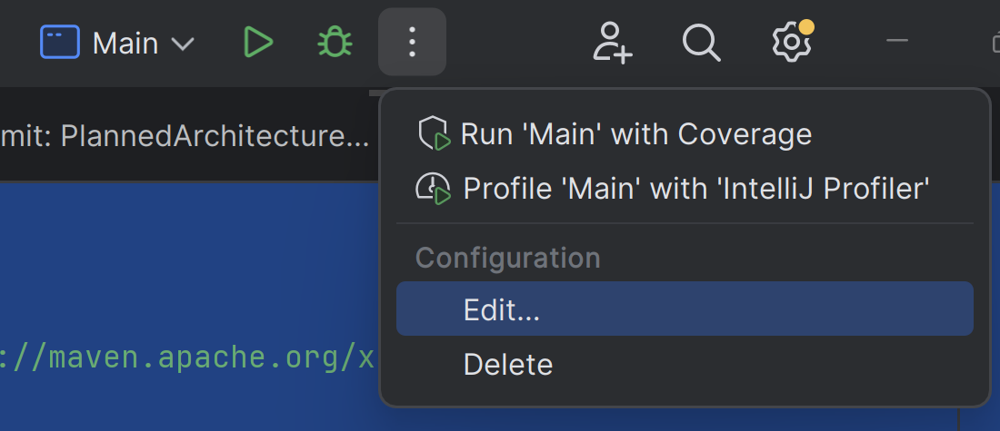
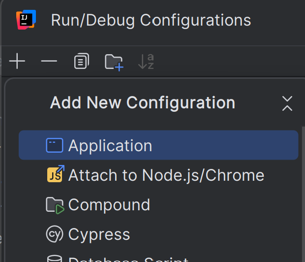
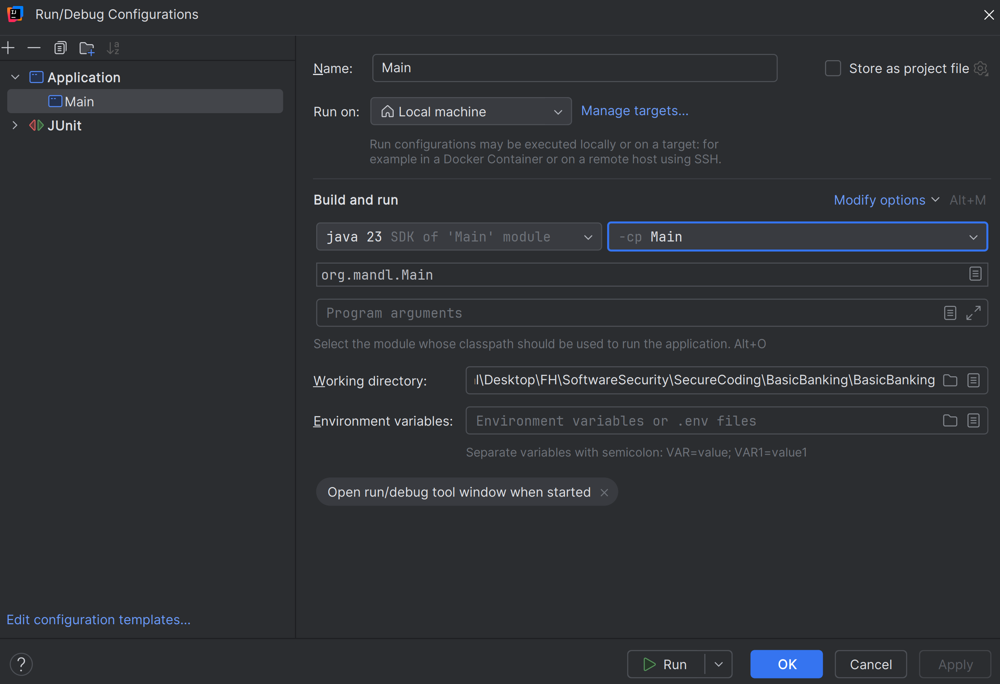
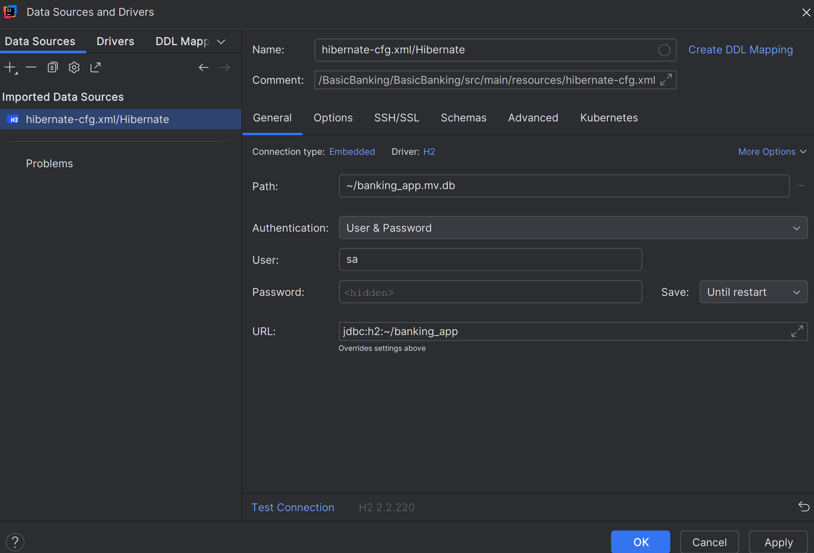

By: Harald Mandl

# Build Instruction

## Voraussetzungen
1. **Java Development Kit (JDK) 23** oder höher installiert.  
2. **Apache Maven** (Version 3.6 oder höher empfohlen).  

## Start
Anleitung für IntelliJ
1. Das Start Modul ist das Modul mit dem Namen `Main`
2. Zuerst das Run/Debug Configurations Menu aufrufen.

3. Neue Konfiguration für Application hinzufügen.

4. Das Modul `Main` als Start festlegen

## Datenbank
Die Datenbank erlaubt nur eine aktive Verbindung! Also kann nicht die ausgeführte Software und über externen DB Framework darauf zugegriffen werden!
Falls DB eingesehen werden will (Kein Passwort)

# Kurze Zusammenfassung
**Die eigentliche Dokumentaiton befindet sich im Ordner Dokumentaiton!**   
Dieses Projekt ist eine **einfache Banking-App**, die anhand der **Onion Architecture** strukturiert ist und großen Wert auf **Encapsulation**, **Abstraction**, **Logging**, **Validation**, sowie **Error Handling** legt. 

## Onion Architecture
- Klare Trennung in Schichten (Domain, Services, Persistence, Contracts, Presentation).
- Abhängigkeiten zeigen ausschließlich von außen nach innen.
- Maximale Isolierung sensibler Daten in der Domain-Schicht.

## Encapsulation und Abstraction
- Sensible Daten (z. B. Kontostände, Benutzerinformationen) werden nur über definierte Schnittstellen in Domain/Service-Ebene angesprochen.
- Abstraktion mithilfe von Interfaces: Änderungen in äußeren Schichten beeinflussen den Kern nicht.

## Logging
- Umsetzung mit Log4j, konfiguriert über eine externe XML-Datei.
- Zentrale Logger-Klasse (`BaseDomainService`) für einheitliches Logging in allen Services.

## Error Handling
- Trennung von Fachlogik (Service) und Präsentationslogik (UI).
- Exceptions aus den Services werden zentral durch einen `ExceptionHandler` verarbeitet.
- Bekannte Fehler werden nutzerfreundlich angezeigt, unbekannte Fehler ausführlich geloggt.

## Validation
- Einfache, kontextabhängige Validierung:
  - Entitäten (Entities) validieren sich selbst (z. B. `setUsername`).
  - Spezielle Validierungen (z. B. Passwörter) werden in dedizierten Services gekapselt.
- Bei einem Server-Client-Setup wäre doppelte Validierung (Client + Server) sinnvoll.

## Cryptography
- JPA-Converter (mit Annotation `@Convert`) verschlüsselt/entschlüsselt automatisch beim Speichern bzw. Laden von Entitätsfeldern.
- Verwendung von AES im GCM-Modus, inklusive IV und Tag-Length-Konfiguration.

